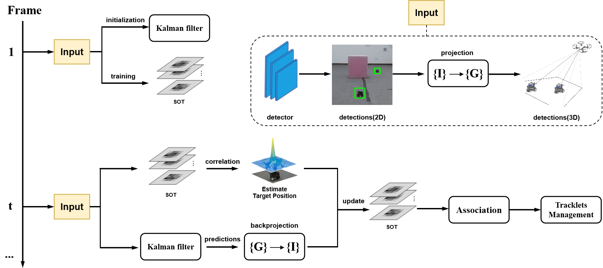
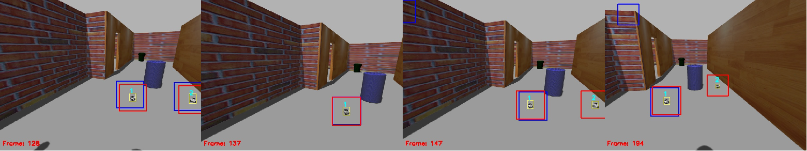
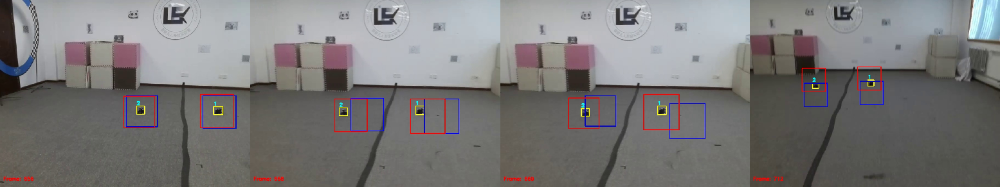

# DbMOT

> **Drone-based Multi-Object Tracking Combining Camera Motion Information and Single Object Tracking. (ICGNC 2024)**
>
> For **Drone-based Multi-Object Tracking (DbMOT)**, camera motion makes it challenging to maintain accurate object prediction and tracking on the 2D image plane. **DbMOT is a ROS node** which leverages **camera motion information** to predict object motion in the 3D space and back-project on the 2D image plane, resulting in more robust and stable data association. Additionally, DbMOT integrates a **single object tracker**, utilizing object motion prediction to guide its search region for enhanced tracking stability. 

## Demonstration

## Framework

## Tracking performance

The process of compensating for the search regions in simulation (above) and real-world experiments (below). The blue box represents the original search region of single object tracker, while the red box represents the adjusted search region.

## How to run

- See [INSTALL.md](./docs/INSTALL.md) for details of installing required components.
- See [DETECTOR.md](./docs/DETECTOR.md) for quickly usage of an off-the-sheld detector ROS node.
- See [TRACKERS.md](./docs/TRACKERS.md) for quickly usage of tracking ROS nodes.
- See [DATA.md](./docs/DATA.md) for usage of simulations and real-world experiments data.

## Acknowledgement and Citation

The codebase is built upon [npurobocourse_sim](https://github.com/npu-ius-lab/npurobocourse_sim), [f1tenth](https://github.com/npu-ius-lab/f1tenth), [DeepSORT](https://github.com/shaoshengsong/DeepSORT), [UCMCTrack](https://github.com/corfyi/UCMCTrack), [YOLOv8](https://github.com/ultralytics/ultralytics), and [CSRT-tracker-standalone](https://github.com/4ndr3aR/CSRT-tracker-standalone). We thank their wondeful works.
